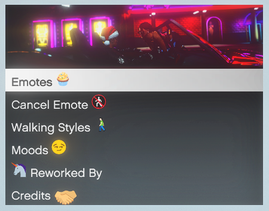
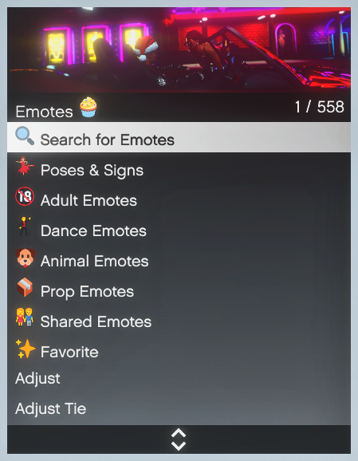
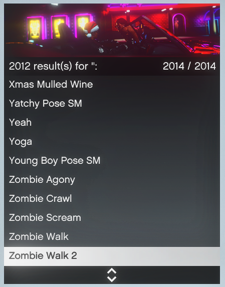

# MrM-Emotes Menu 🦄💃🏼💦 → 2000+ Emotes

 I made this repo cause I heard so many people searching for a leak of this emote menu. So,

### 🚨 This Emote Menu is **NOT for SALE** or **Share** 🖐🏽 and you can't even get it unless you know me personally. It was made for my friends and their servers. 🍻
<br>

<p align="center"> 
 
</p>
<p align="center"> 


</p>


---
## Features 💼
- 🧁 2000+ Emotes.
- 📦 500+ Prop Emotes.
- 💃🏼 400+ Poses & Signs.
- 🕺🏼 200+ Dance Emotes.
- 😍 150+ Moods & Walking Styles
- 💋 100+ Shared Emotes.
- 🔒 Emote Spam Protection.
- 🇱🇰 Sinhala & 🇬🇧 English Languages.

---
## Requirements 🧰
- **You need to know ME personally.** 🦄
- This is a **standalone** script. It means this works on any framework. (QB, ESX, Whatever)

---
## Installation 🐌

```
- unzip the file → mrm-emotes
- place it somewhere in your server's resource folder
```

```
- add → ensure mrm-emotes ...to your server.cfg
```
```lua
- edit the config.lua and change Framework = false, if you are not on "QB-Core"
- restart the server
```

### **📍 Keep in mind:**
> The script will not work, if you change the resource folder name to something else, other than **"mrm-emotes"**. 

---

> This is a Fork of DPemotes. Much 🤍 @DullPear & @Tay.